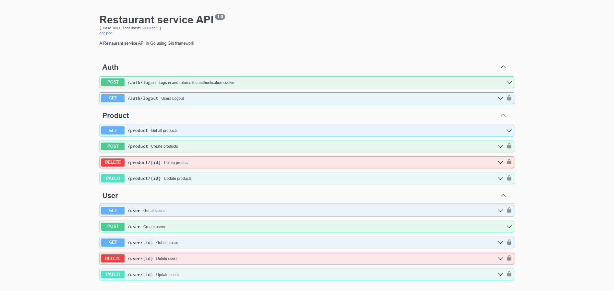

# Projeto Pessoal 
### Uma API para um restaurante/hamburgueria utilizando Golang com o framework Gin
Construir uma API RESTful CRUD(Create, Read, Update, Delete) com Golang, Gin e Gorm é um processo simples.
Gin é um framework popular para construir APIs em Golang, e Gorm é uma biblioteca ORM(Object-Relational Mapping) para trabalhar com o banco de dados(Postgres) em Golang.
Juntas, estas bibliotecas facilitam a construção de um CRUD API robusto e eficiente.

## Ferramentas
- Golang
- Gin
- Gorm
- JWT
- Cloudinary (upload das imagens)
- Swagger
- Postgres
- Docker compose (imagens do banco de dados e pgAdmin)
- Insomnia (testes dos requests)

                                                                      =======ENGLISH=======
# Personal Project 
### A restaurant/fast-food service API using Golang with Gin framework
Building a RESTful CRUD(Create, Read, Update, Delete) API with Golang, Gin, and Gorm is a straightforward process.
Gin is a popular web framework for building APIs in Golang, and Gorm is an ORM(Object-Relational Mapping) library for working with databases in Golang.
Together, these two libraries make it easy to build a robust and efficient CRUD API.

## Tools
- Golang
- Gin
- Gorm
- JWT
- Cloudinary (upload images)
- Swagger
- Postgres
- Docker compose (database and pgAdmin images)
- Insomnia (requests test)

## Project

